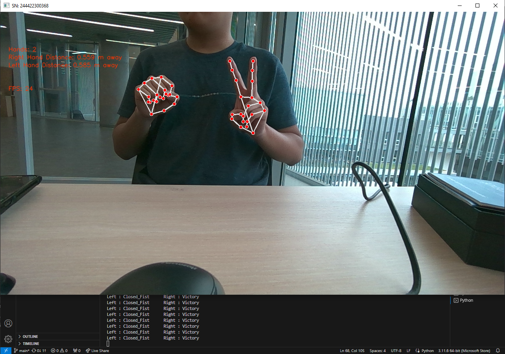

# Hand Gesture Recognition App
Aplicacion para reconocer manos utilizando un Intel Realsense D455 como camara y sensor de profundidad, y Mediapipe como modelo para detectar manos y gestos.
Detecta la estrucura de la mano, coordenadas de los puntos, su profundidad y el gesto reconocido.

## Objetivo del proyecto
El objetivo es principalmente lograr recibir informacion de una camara de profundidad Realsense, pasar el fotograma a un modelo de reconocimiento de manos y finalmente obtener una aproximacion de los puntos de la mano para replicarla en un programa externo. Para ello, el principal foto de atencion es identificar que modelo de reconocimiento de manos utilizar, por lo que se realizo una comparativa entre los modelos encontrados.

## Estructura del proyecto
basic_text: contiene las pruebas iniciales para utilizar la camara a color, la camara a profundidad del Realsense y un modelo reconocimiento de manos inicial.
screenshots: contiene capturas de pantalla del funcionamiento final del modelo.
tasks: contiene los modelos en archivos .task
hand_models_test: Contiene los test de los modelos que se explicaran mas adelante.

## Hand_Tracker
El codigo final del programa fue elaborado utilizando el modelo GestureRecognizer de Mediapipe, el cual fue el mejor modelo encontrado. Primero se obtiene el fotograma a color y a profundidad del Realsense. Luego, el fotograma a color es enviado al GestureRecognizer para obtener las coordenadas y el gesto de la mano. Despues, la posicion de la mano es enviada al fotograma de profundidad para obtener la profundidad de la mano. Finalmente, los datos son enviados a otro programa utilizando un socket, en este caso, se envia al unity-hand-tracking para poder visualizar la mano. Cabe resaltas que el modelo GestureRecognizer procesa el fotograma de la camara de forma sincronica, por lo que el limite de fotogramas lo impone el modelo.

### Test 0: Old Mediapipe
Este programa fue realizado utilizando la guia antigua de GestureRecognizer de Mediapipe, por lo que utiliza metodos y librerias se volveran obsoletas. El programa pasa cada frame de la camara a traves del GestureRecognizer y luego utiliza mediapipe.solutions.hands para dibujarlo en la pantalla.

### Test 1: Mediapipe: GestureRecognizer async
El modelo usado es GestureRecognizer de Mediapipe, sin embargo, el procesamiento de imagenes se realiza asincronicamente, por lo que el limite de fps lo impone la camara. Desafortunadamente, el modelo no es capaz de seguir los fps de la camara, por lo que el procesamiento de la profundidad de la mano comienza a arrojar datos erroneos.

### Test 2: Mediapipe: HandLandmarker
El modelo usado es HandLankmarker de Mediapipe. Este modelo solamente entrega los puntos de una mano que recibe de la camara. Sin embargo, comparando el HandLandmarker con el GestureRecognizer, el GestureRecognizer arrojaba mejores resultados en la deteccion de la mano y adicionalmente arroja el gesto reconocido, por lo que se descartó el uso de este modelo.

### Test 3: Holist
Este modelo Holistic de Mediapipe es capaz de detectar la cara, la mano y el cuerpo. Sin embargo, al hacer la deteccion de todo el cuerpo, solamente detecta la presencia y la posicion de la mano en general, no es capaz de detectar las coordenadas de cada punto de la mano.

### Test 4: HandTrackingModule
El modelo usado es HandTrackingModule de CVZone. Este modelo es capaz de obtener las coordenadas de los puntos de la mano; sin embargo, comparado con los demas modelos, el RestureRecognizer de Mediapipe maneja mejor los casos en los que la mano esta en una posicion dificil de procesar, como por ejemplo, teniendo la mano estirada y mostrando solo las puntas de los dedos hacia la camara.

### Test 5: Tensorflow
El modelo usado es el solutions.hands de Mediapipe. Este modelo es una simplificacion de HandLandmarker de Mediapipe, los resultados son mas faciles de entender a cambio de no devolver otros datos que pueden no ser tan relevantes. Sin embargo, este modelo sufre el mismo problema del HandLandmarker, que arroja peores resultados que GestureRecognizer.

## Recomendaciones
- Para utilizar el programa, se recomienda que solo un usuario este mostrando sus manos frente a la camara. Incluso aunque el modelo esta limitado a solo reconocer un par manos, mostrar varias manos en la camara puede generar que el modelo muestre dos manos aleatorias entre todas las manos detectadas.
- Al posicionar la camara, es recomendable ponerla en un angulo en el que casi siempre la camara pueda ver todos los puntos de la mano desde la palma hasta todos los dedos. Principalmente debido a que si ciertas partes de la mano son ocultadas de la camara, el modelo intentara inferirlos, aumentando la probabilidad de errar en la obtencion de los puntos.
- Se recomienda colocar la camara en un ambiente cerrado ya que el modelo obtiene los puntos de la mano utilizando el color, por lo que colocar la camara en contraluz o a oscuras no permitira al modelo trabajar correctamente. Ademas, para una mejor obtencion de la profundidad, se recomienda colocar la camara d emodo en el fondo tenga una pare plana, ya que asi prodra calibrarse mejor para obtener la profundidad del objeto en cuestion.
